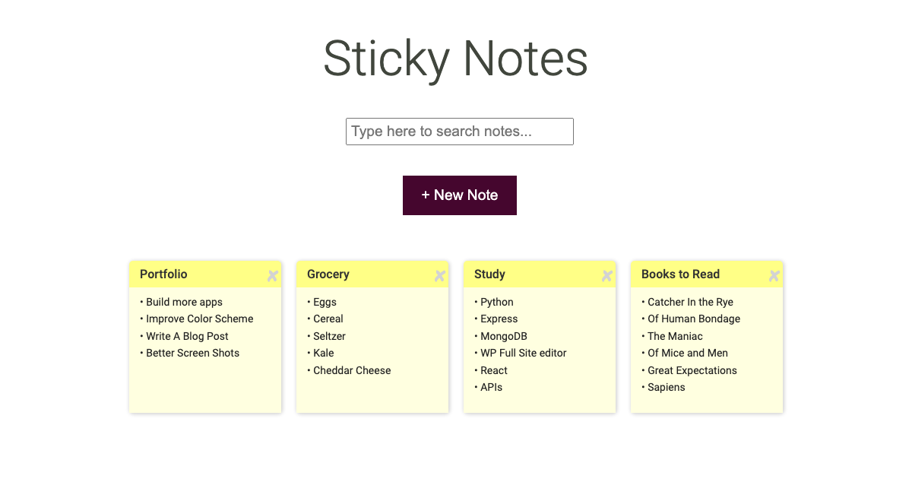

# Sticky Note Application

## Description:
This project I originally built in React while I was working on the [Skillcrush Break Into Tech Frontend Developer Track](https://skillcrush.com/break-into-tech-blueprint/). I finished the program in 2021. In 2024 I revisited the CSS and reviewed the code.

This project I had originally built with CreateReact App but in 2024 I switched my local copy to Vite and also deployed the app on netlify. When I update the project locally and push to GitHub, netlify automatically rebuilds it!

[View project on netlify](https://sticky-note-2024.netlify.app/)
